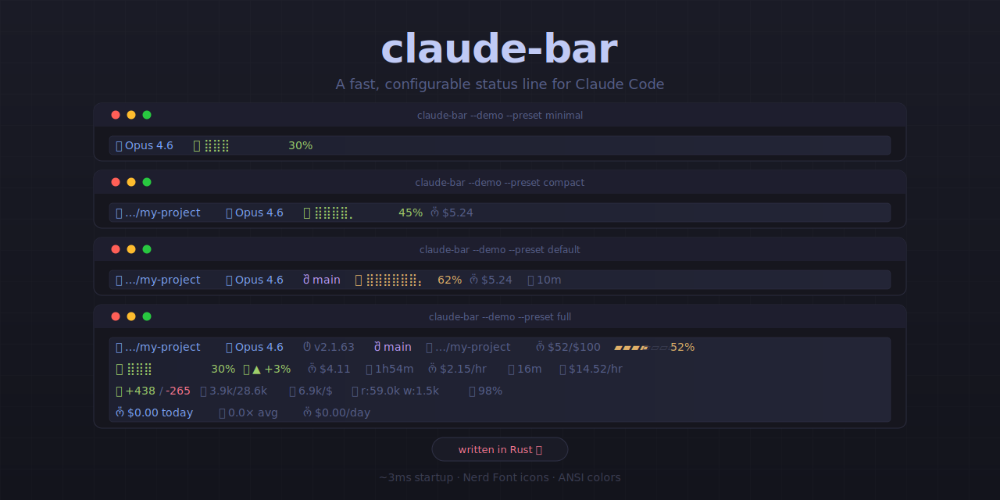

# claude-bar

A configurable status line for [Claude Code](https://docs.anthropic.com/en/docs/claude-code). Shows model info, context usage, token counts, cost, and more — rendered as a single line with [Nerd Font](https://www.nerdfonts.com/) icons.

<p align="center">
  
</p>

## Quick start

```bash
brew tap petispaespea/tap
brew install claude-bar
claude-bar --setup
```

Or build from source:

```bash
git clone https://github.com/petispaespea/claude-bar.git
cd claude-bar
cargo build --release
./target/release/claude-bar --setup
```

The `--setup` flag adds the `statusLine` entry to `~/.claude/settings.json`. Restart Claude Code to see it.

Preview without running Claude Code:

```bash
claude-bar --demo
claude-bar --demo --preset full
```

## Configuration

All settings can be passed as CLI flags or set via env vars in `~/.claude/settings.json`. CLI flags take priority over env vars, which take priority over the `default` preset.

### Presets

| Preset    | Elements                                                      |
|-----------|---------------------------------------------------------------|
| `minimal` | model, gauge, context                                         |
| `compact` | model, gauge, context, cost, cwd                              |
| `default` | model, gauge, context, tokens, duration, cwd, project, style  |
| `full`    | all elements                                                  |

Set via `--preset` flag or `CLAUDE_BAR` env var:

```json
{
  "env": {
    "CLAUDE_BAR": "compact"
  }
}
```

### Custom layout

Cherry-pick elements with `--elements` or a comma-separated `CLAUDE_BAR` value:

```json
{
  "env": {
    "CLAUDE_BAR": "model,gauge,ctx,cost,cwd"
  }
}
```

### Icon sets

| Set           | Flag / env var                                          |
|---------------|---------------------------------------------------------|
| Octicons      | default, or `--icon-set octicons`                       |
| Font Awesome  | `--icon-set fa` or `CLAUDE_BAR_ICON_SET=fa`             |
| None          | `--no-icons` or `CLAUDE_BAR_ICON_SET=none`                |

## Elements

| Name                       | Description                                |
|----------------------------|--------------------------------------------|
| `model`                    | Model display name (e.g. Opus 4.6)         |
| `version`                  | Claude Code version                        |
| `gauge`                    | Braille-dot context bar (color-coded)      |
| `context`, `ctx`           | Context usage percentage                   |
| `tokens`                   | Input/output token counts (e.g. 3.9k/28.6k)|
| `cache`                    | Cache read/write tokens (e.g. r:59k w:1.5k)|
| `cost`                     | Session cost in USD                        |
| `lines`                    | Lines added/removed                        |
| `duration`, `time`         | API wait time                              |
| `cwd`                      | Working directory (shortened)              |
| `project`, `project_dir`   | Project root (shortened)                   |
| `style`, `output_style`    | Output style (hidden when "default")       |

The gauge uses color-coded thresholds: green (< 50%), yellow (50-79%), red (80%+). A `CTX EXCEEDED` warning appears when the context window is full.

## CLI reference

```
claude-bar --setup                            # Configure ~/.claude/settings.json
claude-bar --demo                             # Preview with sample data
claude-bar --demo --preset full               # Preview a specific preset
claude-bar --demo --elements model,gauge,ctx  # Preview a custom layout
claude-bar --demo --icon-set fa               # Preview Font Awesome icons
claude-bar --demo --no-icons                  # Preview without icons
claude-bar --list                             # Show all presets, elements, icon sets
claude-bar --completions bash                 # Generate shell completions
claude-bar --help                             # Full usage info
```
